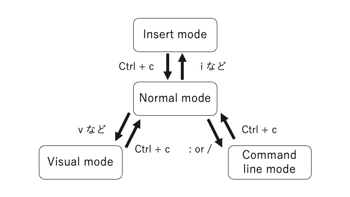

<!-- omit in toc -->
# ランチLT 5/27
簡単な話はサラッと流して、機能紹介をメインに

<!-- omit in toc -->
## 目次
- [vimを使うメリット](#vimを使うメリット)
- [vimmerがvimに求めること](#vimmerがvimに求めること)
- [vimのモードについて](#vimのモードについて)
- [移動](#移動)
  - [一文字移動](#一文字移動)
  - [行の移動](#行の移動)
    - [ファイルの先頭、末尾](#ファイルの先頭末尾)
    - [空行移動](#空行移動)
    - [行番号指定](#行番号指定)
    - [表示画面上で移動](#表示画面上で移動)
    - [マーク＋マークした位置に移動](#マークマークした位置に移動)
  - [画面移動](#画面移動)
    - [page up/down](#page-updown)
    - [page half up/down](#page-half-updown)
    - [一行移動](#一行移動)
    - [カーソル位置を基準に表示位置を](#カーソル位置を基準に表示位置を)
  - [列の移動](#列の移動)
    - [単語間の移動](#単語間の移動)
    - [文字検索で移動](#文字検索で移動)
- [編集](#編集)
  - [insert modeに入る](#insert-modeに入る)
    - [カーソルの前後から入る](#カーソルの前後から入る)
    - [行の先頭、末尾から入る](#行の先頭末尾から入る)
    - [行を追加して入る](#行を追加して入る)
    - [カーソル下の文字を削除して入る](#カーソル下の文字を削除して入る)
  - [文字置き換え](#文字置き換え)
- [検索](#検索)
  - [ファイル内検索](#ファイル内検索)
  - [単語検索](#単語検索)
- [画面操作](#画面操作)
  - [画面分割関連](#画面分割関連)
    - [画面の分割](#画面の分割)
    - [分割した画面の移動](#分割した画面の移動)
  - [タブ](#タブ)
- [ケーススタディ](#ケーススタディ)
  - [クソ長い変数のtypoを修正](#クソ長い変数のtypoを修正)
  - [キャメルcaseのtypoを修正](#キャメルcaseのtypoを修正)
  - [error messageを見て該当箇所を編集](#error-messageを見て該当箇所を編集)
  - [一行コピーして直下/直上にペースト](#一行コピーして直下直上にペースト)
  - [関数を跨ぐ変数を探索をして元の位置に戻る](#関数を跨ぐ変数を探索をして元の位置に戻る)
  - [スネークcaseをキャメルcaseに変換する](#スネークcaseをキャメルcaseに変換する)
  - [キャメルcaseをスネークcaseに変換する](#キャメルcaseをスネークcaseに変換する)
  - [括弧などの中を削除して編集](#括弧などの中を削除して編集)

## vimを使うメリット
* どの高機能editorでも、大体vimのキーマップを再現するプラグインがある。  
  -> 学習コスト低め
* 高機能editorの機能は大体vimキーマップで再現できる。  
  -> サーバでも高速編集できる

日本語入力と合わせるとクソ使いにくいのが欠点。
高機能エディタなら大抵の機能をエディタ側で代替できるが、大体vimの方がtype数が少ない。
逆に、エディタの方がtype数が少ないものもあるので、それはエディタ側でやった方がいい。

## vimmerがvimに求めること
最終的には、コード編集している時間を減らしたいが求めることですが、、、
* 一回でもタイプする回数を減らしたい
* どこでも同じように書きたい

という願望を持っている人がvimmerには多いようです。
結果として、デフォルトで高機能な編集機能を持ったeditorであり、emacsとは異なりカスタムをなるべくしないで使うことが一般的なようです。

## vimのモードについて
vimには以下のモードがある。
* normal mode   - カーソルを移動させるモード
* insert mode   - 文字入力するモード
* visual mode   - 文字選択するモード
* command line mode   -  諸々の操作をするためのモード



normalは`Ctrl+C`で戻るべし

---
## 移動
### 一文字移動
`hjkl`  

まぁ、キー配列見れば感覚的にわかるはず  
j: 下移動  
k: 上移動  
h: 左移動  
l: 右移動

### 行の移動
#### ファイルの先頭、末尾
`gg`  
importいじる時

`shift + g`  
最新のlogを見る時

#### 空行移動
`[, ]`  
ブロック間の移動。移動量が小さい時に便利。  
バカでかブロックがあると死

#### 行番号指定
`number -> shift + G`  
error logとかで参照行がわかっている時に便利

#### 表示画面上で移動
`Shift + h, m, l`  
下記の位置にカーソルを移動する。  
ぶっちゃけ、画面中をに持ってくるしか使わない。
画面位置を動かして編集箇所を真ん中にして`Shift + m`がメイン。

`h`: 画面上部  
`m`: 画面中央  
`l`: 画面下部  

#### マーク＋マークした位置に移動
`m + [任意の文字]`でマーク、``', ` + [任意の文字]``で保存されている位置に移動。  
`a-z`: ファイル内でのみ有効なマーク  
`A-Z0-9`: グローバルで有効なマーク
他にもvim側が自動的に保存しているマークもある。

`'`: マークした行の空行でない先頭に移動  
`` ` ``: マークした位置（列方向の位置も含む）に移動  


`:marks`: マーク一覧を表示

### 画面移動
#### page up/down
`Ctrl + , b`  
f: forward  
b: backward

#### page half up/down
`Ctrl + u, d`  
u: up  
d: down

#### 一行移動
`Ctrl + y, e`  
y: 上方向に移動  
e: 下方向に移動

画面外のものをちょっと見たい時や見やすい位置に編集箇所を持っていくなど

#### カーソル位置を基準に表示位置を
`z -> t, z, b`  
カーソル位置が下記の位置にくるように画面表示を移動
t: 画面上部（top）
z: 画面中央
b: 画面下部（bottom）

ぶっちゃけ、画面中央にする以外使わない。
カーソルを編集位置に移動させて or 編集でカーソルが画面端にいってしまったので画面中央に移動

### 列の移動
#### 単語間の移動
`w, e, b, shift + {w, e, b}`  
横移動は基本これ

#### 文字検索で移動
`f -> [任意の文字], shift + f -> [任意の文字]`  
任意の文字まで移動できる。通常は後方、shiftで前方を検索。  

母音以外の文字にたどり着きたい時は大体これ使う。
（大文字が区別されるので、キャメルケースとの相性がいい）  
```js
let abc;
const abcdefghijklmn = 1;
abc = abcdefhhijklmn + 1;  // fhh -> fgh
```

もう少し現実的な例。。。
```js
const damageByAttack = 10;
const damageByPoison = 10;
const damageByAttackAndPoison = damageByAttack + damageByQoison;  // Q -> P
```

`;`で次の該当文字まで移るので、一回でたどり着かなくても大丈夫。
ちなみに、`,`で前の該当箇所に移動。
```js
const damageByAttack = 10;
const damageByPoison = 10;
const damageByAttackAndQoison = damageByAttack + damageByQoison;  // Q -> P
```

---
## 編集
### insert modeに入る
#### カーソルの前後から入る
`i, a`  
i: カーソル位置前に入る（insert）  
a: カーソル位置の後ろに入る

#### 行の先頭、末尾から入る
`shift + i, a`  
i: カーソルがある行の先頭から入る  
```js
a = 1;  // constの追加
```

a: カーソルがある行の末尾から入る  
```js
const tmp = 1; 
```


#### 行を追加して入る
`o, shift + o`  
o: カーソル直下に行を追加して入る  
shift + o: カーソル直上に行を追加して入る

#### カーソル下の文字を削除して入る

### 文字置き換え
`r`  
カーソル位置の一文字を置き換え。
```js
const n = 1;
const a = m + 1;  // m -> n
```

`shift + r`  
カーソル以降置き換え
```js
const damageByAttack = 10;
const defense = 5;
const damage = damageByPoison - defense;  // Poison -> Attack
```

---
## 検索
### ファイル内検索

### 単語検索
`*, #`  
カーソル位置にある単語を検索 
*: 前方検索
#: 後方検索

---
## 画面操作
### 画面分割関連
#### 画面の分割

#### 分割した画面の移動

### タブ
正直、タブ操作はデフォルトのままではあまり使いやすくない。
IDEと合わせて使うならタブ移動ぐらい

---
## ケーススタディ

### クソ長い変数のtypoを修正
  1. `f -> h`
  2. `r -> g`
```js
let abc;
const abcdefghijklmn = 1;
abc = abcdefhhijklmn + 1;  // fhh -> fgh
```

### キャメルcaseのtypoを修正
  1. `f -> Q`
  2. `r -> P`
  3. `;`
  4. `.`  // 直前の動作（2の動作）を実行

```js
const damageByAttack = 10;
const damageByPoison = 10;
const damageByAttackAndPoison = damageByAttack + damageByPoison;  // Q -> P
```

### error messageを見て該当箇所を編集
  1. `[該当の行数]　-> Shift + G`
  2. `f -> r`
  3. `r -> t`

error message
```
ReferenceError: counr is not defined
    at <anonymous>:{該当の行数}:9
    at hn (https://preview-typescript.playcode.io/:18:5449)
```

コード
```js
const count = 0;
const a = counr;  // r -> t
```

### 一行コピーして直下/直上にペースト
  1. `Shift + v` &emsp; // 一行選択
  2. `y` &emsp; // 文字の削除（レジスタへの登録も含むので、カットと同様の操作）
  3. `p` &emsp; // ペースト
  4. `f -> A`
  5. `c -> e` &emsp; // `e`で移動する位置まで削除して、insert modeに入る
  6. `Poison -> Ctrl + c`

```js
const damageByAttack = 10;
// const damageByPoison = 10; この行を追加
```

### 関数を跨ぐ変数を探索をして元の位置に戻る
  1. `m -> a` &emsp; // `a `にカーソルのある行を記憶させる。（`a`は任意の文字でOK）
  2. `*` &emsp;  // カーソル上の単語を後方検索
  3. `n` &emsp; // 次の検索候補に移動
  4. `' -> a` &emsp; // `a`に記憶した位置に戻る。

```js
function AddOne (count) {
  return count + 1;
}

function AddTen (count) {
  return count + 10;
}

let count = 0;
count = AddOne(count);
count = AddTen(count);
```

### スネークcaseをキャメルcaseに変換する
 1. `q -> a` &emsp; //レコーディングスタート（aは任意の文字列で可）
 3. `/_` &emsp; // "_"を後方検索
 4. `x` &emsp; // 一文字削除
 5. `v` &emsp; // 一文字選択
 6. `U` &emsp; // 選択文字の大文字化
 7. `q` &emsp; // レコーディング終了
 8. `11 -> @ -> a` &emsp; // 11回`a`に記録された動作を繰り返す

```js
const damage_by_attack = 10;
const damage_by_poison = 10;
const damage_by_attack_and_poison = damage_by_attack + damage_by_poison;
```

### キャメルcaseをスネークcaseに変換する
 1. `q -> a` &emsp; //レコーディングスタート（aは任意の文字列で可）
 2. `/[A-Z]` &emsp; // 検索は正規表現をサポート
 3. `v` &emsp; // 一文字選択
 4. `u` &emsp; // 選択文字の小文字化
 5. `q` &emsp; // レコーディング終了
 6. `11 -> @ -> a` &emsp; // 11回`a`に記録された動作を繰り返す


```js
const damageByAttack = 10;
const damageByPoison = 10;
const damageByAttackAndPoison = damageByAttack + damageByPoison;
```

### 括弧などの中を削除して編集
  1. `c -> i -> '` &emsp; // `'`の中を削除して、insert modeに入る
  2. 文字入力
  3. `d -> i -> '` &emsp; // `'`の中を削除

このコマンドはかなり汎用性が高くて
`c, d` -> `i`に  
  * [任意の括弧]
  * w &emsp; // word
  * t &emsp; // tag
を入れることができる

```js
export const MONTHLY_QUESTIONS_TEXT: Record<string, { title: string; note?: string }> = {
  [MONTHLY_QUESTIONS.NAME]: {
    title: '名前を入力してください',  // title: 'お名前を教えてください',
    note: '注意書きが入ります',  // note: '',
  },
}
```

```js
export const MonthlyRegisterOptionsInput: React.FC<BaseProps<any>> = ({ control }) => (
  <div>
    <div className={styles.fullWidthContainer}>
      <TextInputControl name="phoneNumber" control={control} placeholder="電話番号" />
    </div>
  </div>
);
```